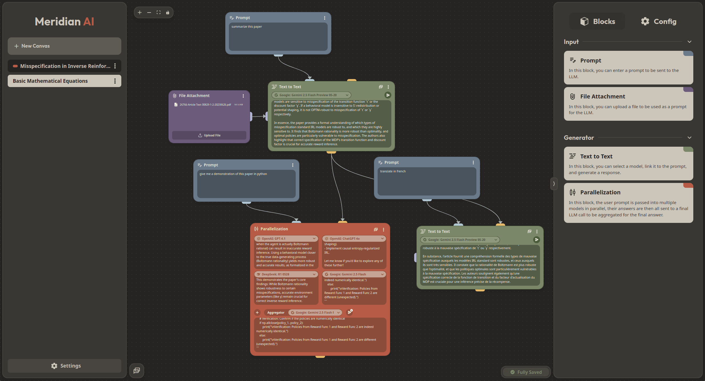

<div align="center">

# Meridian - Graph-Powered Conversational AI

[](https://opensource.org/licenses/MIT)
[](https://nuxt.com/)
[](https://www.python.org/)
[](https://github.com/your-username/your-repo-name/commits/main)

</div>

> [!WARNING]  
> **This project is in its early stages of development.**

## Table of Contents

- [✨ Introduction](#-introduction)
- [🌟 Key Features](#-key-features)
- [🛠️ Technologies Used](#%EF%B8%8F-technologies-used)
- [🏗️ Production Deployment](#%EF%B8%8F-production-deployment)
  - [Prerequisites](#prerequisites)
  - [Production Deployment Setup](#production-deployment-setup)
- [🧑‍💻 Local Development](#-local-development)
  - [Prerequisites](#prerequisites-1)
  - [Local Development Setup](#local-development-setup)
- [📄 API Documentation](#-api-documentation)
- [🗺️ Project Structure](#%EF%B8%8F-project-structure)
- [🤝 Contributing](#-contributing)
- [🐛 Issues and Bug Reports](#-issues-and-bug-reports)
- [📄 License](#-license)

## ✨ Introduction

Welcome to Meridian! Built on a **graph-based architecture**, Meridian goes beyond simple turn-taking, enabling richer, more nuanced, and highly efficient interactions.

Traditional AI chats often struggle with complex queries, requiring multiple back-and-forth interactions to gather information. Our innovative approach, deeply rooted in a dynamic graph structure, allows for **intelligent parallelization** of information gathering and processing. Imagine asking a question, and instead of a linear response, our system simultaneously consults multiple specialized AI models, synthesizing their insights into a coherent, comprehensive, and accurate answer.

This isn't just about speed; it's about depth, accuracy, and unlocking advanced AI workflows previously out of reach for consumer applications.

<p align="center">
    
</p>

## 🌟 Key Features

* **Graph-Based AI Engine:** At its core, Meridian leverages a sophisticated graph database to represent and process information. This allows for complex relationships between concepts, enabling more intelligent context retention and dynamic query planning.
* **Parallel Query Processing:** User prompts can be dispatched to multiple LLMs in parallel. Their responses are then intelligently combined by a final LLM, delivering a unified and comprehensive answer.
* **Model Agnostic:** Powered by [OpenRouter](https://openrouter.ai/), Meridian seamlessly integrates with various AI models, giving you the flexibility to select the optimal model for each scenario.
* **Oauth & UserPass:** Secure user authentication and management, ensuring that your data is protected and accessible only to you.
* **Attachment Support:** Users can upload attachments, enhancing the context and richness of conversations.
* **Syntax Highlighting:** Code snippets are displayed with syntax highlighting, making it easier to read and understand technical content.
* **LaTeX Rendering:** Mathematical expressions are rendered beautifully, allowing for clear communication of complex ideas.
* **Chat Branching:** Using the graph structure, Meridian supports branching conversations, enabling users to explore different paths and topics without losing context.
* **Highly Customizable:** Meridian is highly configurable, allowing you to tailor the system to your specific needs and preferences.

> See a detailed overview of the features in the [Features.md](docs/Features.md) file.

## 🛠️ Technologies Used

*   **Frontend:**
    *   [Nuxt 3](https://nuxt.com/)
    *   [Vue 3](https://vuejs.org/)
    *   [Tailwind CSS](https://tailwindcss.com/)
*   **Backend:**
    *   [Python](https://www.python.org/)
    *   [FastAPI](https://fastapi.tiangolo.com/)
    *   [PostgreSQL](https://www.postgresql.org/)
    *   [Neo4j](https://neo4j.com/)

## 🏗️ Production Deployment

### Prerequisites

*   Docker and Docker Compose installed on your machine.
*   [Yq (from Mike Farah)](https://github.com/mikefarah/yq/#install) for TOML processing.

### Production Deployment Setup

1. **Clone the repository:**
    ```bash
    git clone git@github.com:MathisVerstrepen/Meridian.git
    cd Meridian/docker
    ```

2. **Create a `config.toml` file:**
    Copy the `config.example.toml` file to `config.toml` and customize it with your production settings.
    ```bash
    cp config.example.toml config.toml
    ```
    Then set the necessary environment variables in the `config.toml` file.

> A detailed explanation of the configuration options can be found in the [Config.md](docs/Config.md) file.

3. **Start Meridian:**
    Use the provided bash script to start the Docker services. 
    This will start the two databases (PostgreSQL and Neo4j), the backend API server, and the frontend application.
    ```bash
    chmod +x run.sh
    ./run.sh up -d
    ```

4. **Access the application:**
    Open your web browser and navigate to `http://localhost:3000` (default port) to access the Meridian frontend.

## 🧑‍💻 Local Development

### Prerequisites

*   Docker and Docker Compose installed on your machine.
*   [Yq (from Mike Farah)](https://github.com/mikefarah/yq/#install) for TOML processing.
*   Python 3.11 or higher installed on your machine.
*   [Node.js](https://nodejs.org/) and [npm](https://www.npmjs.com/) installed on your machine for the frontend.

### Local Development Setup

1. **Clone the repository:**
    ```bash
    git clone git@github.com:MathisVerstrepen/Meridian.git
    cd Meridian/docker
    ```

2. **Create a `config.local.toml` file:**
    Copy the `config.local.example.toml` file to `config.local.toml` and customize it with your settings.
    ```bash
    cp config.example.toml config.local.toml
    ```
    Then set the necessary environment variables in the `config.local.toml` file.

> A detailed explanation of the configuration options can be found in the [Config.md](docs/Config.md) file.

3. **Start the databases:**
    Use the provided bash script to start the Docker services. This will start the two databases (PostgreSQL and Neo4j).
    ```bash
    chmod +x run.sh
    ./run.sh dev -d
    ```

4. **Start the backend:**
    Open a new terminal window and run the backend server using Docker Compose.
    ```bash
    cd ../api
    python3 -m venv venv
    source venv/bin/activate
    pip install -r requirements.txt
    cd app
    fastapi dev main.py
    ```

5. **Start the frontend:**
    Open another terminal window and run the frontend server.
    ```bash
    cd ../ui
    npm install
    npm run dev
    ```

6. **Access the application:**
    Open your web browser and navigate to `http://localhost:3000` (default port) to access the Meridian frontend.


## 📄 API Documentation

The backend API documentation (powered by FastAPI's Swagger UI) will be available at:
`http://localhost:8000/docs` (when the backend is running).

## 🗺️ Project Structure

```
Meridian/
├── docker/          # Docker-related files and configurations files
├── api/             # Backend API code
├── ui/              # Frontend code
├── docs/            # Documentation files
├── README.md        # Project overview and setup instructions
```

## 🤝 Contributing

We welcome contributions to Meridian! Whether it's adding new features, improving existing ones, or fixing bugs, your help is appreciated.

## 🐛 Issues and Bug Reports

Found a bug or have a feature request? Please open an issue on our [GitHub Issues page](https://github.com/MathisVerstrepen/Meridian/issues).

## 📄 License

This project is licensed under the MIT License - see the [LICENSE](LICENSE) file for details.

---

Made with ❤️ by Mathis Verstrepen