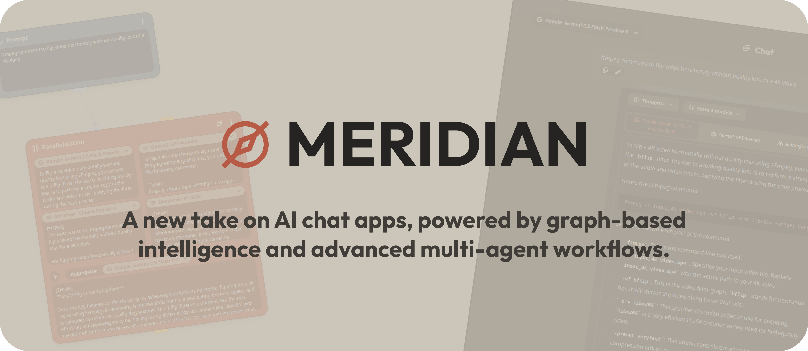
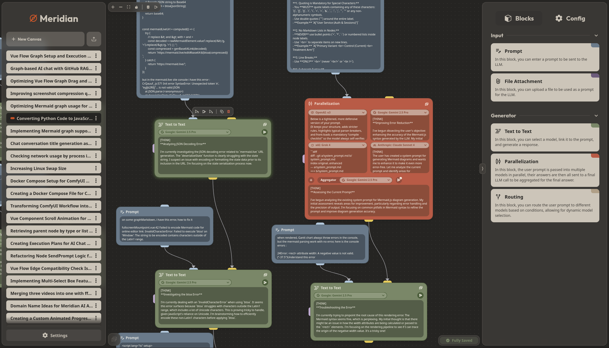
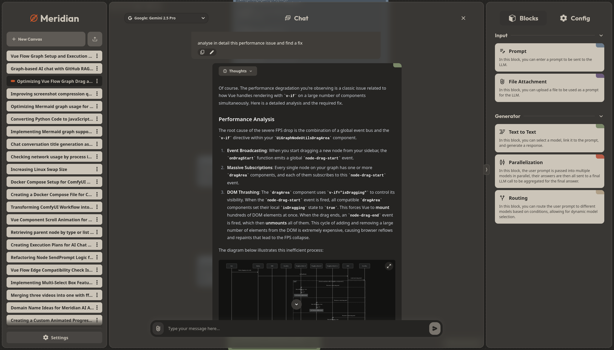
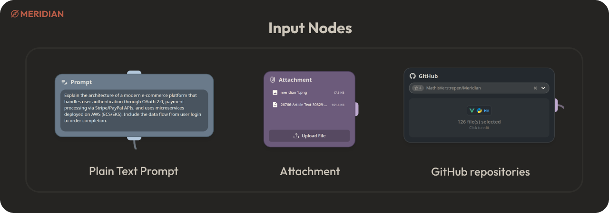
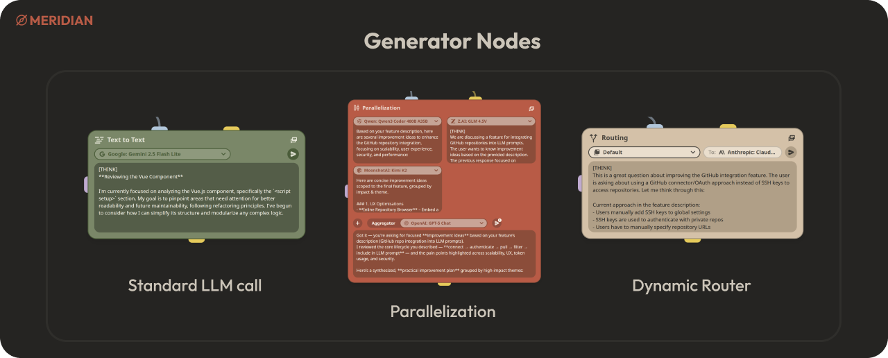
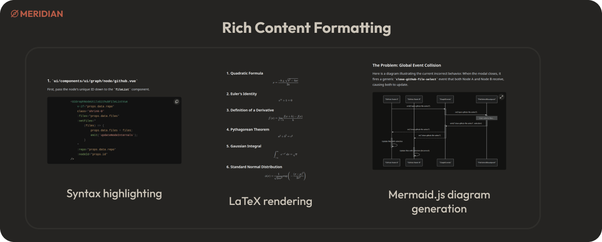

<div align="center">

# Meridian - Graph-Powered Conversational AI

[](https://opensource.org/licenses/MIT)
[](https://nuxt.com/)
[](https://www.python.org/)
[](https://github.com/MathisVerstrepen/Meridian/commits/main)

</div>

## Table of Contents

- [✨ Introduction](#-introduction)
- [🌟 Key Features](#-key-features)
- [🛠️ Technologies Used](#%EF%B8%8F-technologies-used)
- [🏗️ Production Deployment](#%EF%B8%8F-production-deployment)
  - [Prerequisites](#prerequisites)
  - [Deployment Options](#deployment-options)
  - [Essential Configuration](#essential-configuration)
  - [Management Commands](#management-commands)
- [🧑‍💻 Local Development](#-local-development)
  - [Prerequisites](#prerequisites-1)
  - [Development Setup](#development-setup)
  - [Management Commands](#management-commands-1)
- [📄 API Documentation](#-api-documentation)
- [🗺️ Project Structure](#%EF%B8%8F-project-structure)
- [🤝 Contributing](#-contributing)
- [🐛 Issues and Bug Reports](#-issues-and-bug-reports)
- [📄 License](#-license)

## ✨ Introduction

Meridian is an open-source, graph-based platform for building, visualizing, and interacting with complex AI workflows. Instead of traditional linear chats, Meridian uses a visual canvas where you can connect different AI models, data sources, structured tools, and logic blocks to create powerful and dynamic conversational agents.

This graph-based approach allows for sophisticated context management, branching conversations, advanced execution patterns like parallel model querying and conditional routing, and richer tool-assisted workflows. It provides both a powerful visual graph for building workflows and a clean, feature-rich chat interface for interacting with them.

<p align="center">
    
</p>

<p align="center">
    
</p>

## 🌟 Key Features

*   **Visual Graph Canvas**: At its core, Meridian provides an interactive canvas where you can build, manage, and visualize AI workflows as interconnected nodes.

*   **Modular Node System**:
    *   **Input Nodes**: Provide context from various sources, including plain text (`Prompt`), local files (`Attachment`), and connected repositories (`GitHub` and `GitLab`).

    <p align="center">
        
    </p>

    *   **Generator Nodes**: The processing units of the graph.
        *   `Text-to-Text`: A standard Large Language Model (LLM) call.
        *   `Parallelization`: Executes a prompt against multiple LLMs simultaneously and uses an aggregator model to synthesize the results into a single, comprehensive answer.
        *   `Routing`: Dynamically selects the next node or model based on the input, enabling conditional logic in your workflows.

    <p align="center">
        
    </p>

*   **Integrated Chat & Graph Experience**:
    *   A feature-rich chat interface that serves as a user-friendly view of the graph's execution.
    *   The ability to create complex **branching conversations** that are naturally represented and manageable in the graph.
    *   Rich tool call rendering, artifact embeds, structured follow-up questions, and clearer waiting states when a workflow needs user input.

*   **Rich Content & Tooling**:
    *   Full **Markdown** support for text formatting.
    *   **LaTeX** rendering for mathematical and scientific notation.
    *   **Syntax highlighting** for over 200 languages in code blocks.
    *   AI-powered **Mermaid.js diagram generation** with validation and retry support for visualizing data and processes.
    *   Sandboxed **Python code execution** with persisted artifacts rendered inline in chat.
    *   A dedicated **Visualise** tool for Mermaid, SVG, and HTML outputs.
    *   Structured **Ask User** tool support so runs can pause for clarification and resume cleanly.
    *   Deep **GitHub and GitLab integration** to use code from repositories as context for the AI.

    <p align="center">
        
    </p>

*   **Execution & Orchestration Engine**:
    *   Run entire graphs or specific sub-sections (e.g., all nodes upstream or downstream from a selected point).
    *   A visual execution plan that shows the sequence of node processing in real-time.
    *   Safer execution with persistent tool call history, stronger lifecycle handling, and sandbox-backed code runs.

*   **Prompt Improver Workflow**:
    *   Audit prompt nodes across structured quality dimensions.
    *   Generate targeted rewrites, review changes individually, and apply approved edits back to the graph.
    *   Ask clarifying questions during optimization when the model needs more context.

*   **Flexible Model Backend**:
    *   Powered by **OpenRouter.ai**, providing access to a vast array of proprietary and open-source models (from OpenAI, Anthropic, Google, Mistral, and more).
    *   Granular control over model parameters on both global and per-canvas levels.
    *   Dedicated model controls for image generation, prompt improvement, and visual generation workflows.

*   **Enterprise-Ready Foundation**:
    *   Secure authentication with support for **OAuth** (GitHub, Google) and standard username/password.
    *   Persistent and robust data storage using **PostgreSQL** for structured data, **Neo4j** for the graph engine, and **Redis** for caching and runtime support.
    *   Cost and token usage tracking for each model call, providing full transparency.
    *   Stronger provider and repository safety, including safer auth/header handling and stricter repository path protections.
    *   **Monitoring and Error Tracking**: Optional integration with **Sentry** for real-time performance monitoring and error tracking in both frontend and backend services.

> [!TIP]
> Detailed overview of the features in the [features.md](docs/features.md) file.
> Latest release notes are available in [docs/changelogs/Update-1.4.0.md](docs/changelogs/Update-1.4.0.md).

## 🛠️ Technologies Used

*   **Frontend:**
    *   [Nuxt 4](https://nuxt.com/)
    *   [Vue 3](https://vuejs.org/)
    *   [Tailwind CSS](https://tailwindcss.com/)
*   **Backend:**
    *   [Python](https://www.python.org/)
    *   [FastAPI](https://fastapi.tiangolo.com/)
    *   [PostgreSQL](https://www.postgresql.org/)
    *   [Neo4j](https://neo4j.com/)
    *   [Redis](https://redis.io/)
*   **Execution Runtime:**
    *   Sandbox Manager (FastAPI + Docker + NSJail)

## 🏗️ Production Deployment

Meridian offers multiple deployment options to suit different needs and environments. Choose the approach that best fits your infrastructure and requirements.

### Prerequisites

*   **Docker and Docker Compose** installed on your machine
*   **[Yq (from Mike Farah)](https://github.com/mikefarah/yq/#install)** v4, or `curl`/`wget` so the renderer can install its pinned copy
*   **Git** (for cloning the repository)
*   Docker daemon access for the sandbox execution service if you want sandboxed code execution enabled

### Deployment Options

#### Option 1: Quick Start with Pre-built Images (Recommended)

Use pre-built images from GitHub Container Registry for the fastest deployment.

1. **Clone the repository:**
    ```bash
    git clone https://github.com/MathisVerstrepen/Meridian.git
    cd Meridian
    ```

2. **Create sparse production configuration and mandatory secrets:**
    ```bash
    make config-init-prod
    ```
    Run this target from the repository root. It does not overwrite existing files and enforces mode `0600` on `docker/config/secrets/production.env`. Put only non-secret differences in `docker/config/overrides/production.yaml`, fill every required key in the mandatory `docker/config/secrets/production.env`, then run `./docker/run.sh prod --config-only`. See the [Configuration Guide](docs/config.md) for fields, migration, and rollback.

3. **Deploy with pre-built images:**
    ```bash
    cd docker
    chmod +x run.sh
    ./run.sh prod -d
    ```

4. **Access the application:**
    Open `http://localhost:3000` (or your configured port) in your web browser.

`./run.sh prod` now also prepares the sandbox worker image used by code execution and generated artifact workflows.

The deployment also starts the independently published `browser-service` image. Configure its dedicated token in `config/secrets/production.env`; production exposes the sidecar only to Compose networks, while local development publishes it on loopback. Browser fallback unavailability does not disable direct or ordinary-proxy link extraction. See [Browser Service](browser_service/README.md) for capacity, isolation limits, token rotation, and rollback.

#### Option 2: Build from Source

Build images locally for customization or when pre-built images aren't suitable.

1. **Clone and configure:**
    ```bash
    git clone https://github.com/MathisVerstrepen/Meridian.git
    cd Meridian
    make config-init-prod
    # Edit docker/config/overrides/production.yaml and fill every required
    # key in docker/config/secrets/production.env, then preflight:
    ./docker/run.sh build --config-only
    ```

    `make config-init-prod` does not overwrite either existing profile file and always enforces mode `0600` on the production secrets file.

2. **Deploy with local builds:**
    ```bash
    cd docker
    chmod +x run.sh
    ./run.sh build -d
    ```

3. **Force rebuild (if needed):**
    ```bash
    ./run.sh build --force-rebuild -d
    ```

Build mode also builds the dedicated sandbox worker image.

### Essential Configuration

Before deploying, you **must** provide all required keys in `config/secrets/production.env` (or `local.env` for development):

#### Required Settings
```dotenv
NUXT_SESSION_PASSWORD=
MASTER_OPEN_ROUTER_API_KEY=
BACKEND_SECRET=
JWT_SECRET_KEY=
LINK_EXTRACTION_BROWSER_SERVICE_TOKEN=
REDIS_PASSWORD=
POSTGRES_PASSWORD=
NEO4J_PASSWORD=
```

Tracked common and production defaults include the sandbox manager, execution, artifact, input, and resource limits. Override only values that differ at your site; upgrades automatically inherit newly tracked defaults.

#### Optional: Sentry for Monitoring
To enable performance monitoring and error tracking, provide your Sentry DSN. If left empty, Sentry will be disabled.

```yaml
version: 1
settings:
  observability:
    sentry:
      dsn: "https://public-key@sentry.example/1"
```

> 📚 **Detailed Configuration Guide:** See [config.md](docs/config.md) for complete configuration options and OAuth setup instructions.

### Management Commands

#### Starting Services
```bash
# Production mode with pre-built images
./run.sh prod -d

# Build mode (compile locally)
./run.sh build -d

# Force rebuild without cache
./run.sh build --force-rebuild -d
```

After upgrading between releases that add migrations, run the backend migrations before or during startup. `1.4.0` introduced schema updates for tool calls and Prompt Improver state.

#### Stopping Services
```bash
# Stop services (preserve data)
./run.sh prod down

# Stop services and remove volumes (⚠️ deletes all data)
./run.sh prod down -v
```

#### Monitoring and Maintenance
```bash
# View logs
docker compose -f docker-compose.prod.yml logs -f

# Check service status
docker compose -f docker-compose.prod.yml ps

# Update to latest images
docker compose -f docker-compose.prod.yml pull
./run.sh prod down
./run.sh prod -d
```

## 🧑‍💻 Local Development

Set up Meridian for local development with hot reloading, debugging capabilities, and direct access to logs. This setup runs databases in Docker while keeping the application services local for optimal development experience.

### Prerequisites

*   **Docker and Docker Compose** installed on your machine
*   **[Yq (from Mike Farah)](https://github.com/mikefarah/yq/#install)** v4, or `curl`/`wget` so the renderer can install its pinned copy
*   **Python 3.11 or higher** for the backend
*   **Node.js 22.19+ on Node 22, 24.11+ on Node 24, or 26+, and pnpm/npm** for the frontend (CI and containers use Node 24)
*   **Git** (for cloning the repository)

### Development Setup

#### 1. Clone and Configure

```bash
# Clone the repository
git clone https://github.com/MathisVerstrepen/Meridian.git
cd Meridian

# Create a sparse local override and mandatory local secrets
make config-init-dev
```

Run the target from the repository root. It does not overwrite existing files and enforces mode `0600` on `docker/config/secrets/local.env`.

#### 2. Configure for Development

Fill every required value in the mandatory `docker/config/secrets/local.env`. Put only local non-secret differences in `docker/config/overrides/local.yaml`, using friendly lowercase paths:

```yaml
version: 1
settings:
  deployment:
    name: "meridian_dev"
  limits:
    free:
      storage_mib: 100
```

Validate without starting Docker from the repository root: `./docker/run.sh dev --config-only`. The generated `docker/env/.env.local` remains the source for host API, migrations, and frontend generation; the browser proxy secret is retained only in `docker/env/.env.compose.local`.

> 📚 **Configuration Reference:** See [config.md](docs/config.md) for all available options.

#### 3. Start the Full Stack (Quick Start)

From the repository root, a single script starts Docker databases, runs migrations, and launches the backend and frontend in order — waiting for each service to be ready before proceeding:

```bash
chmod +x scripts/dev.sh
./scripts/dev.sh
```

This is equivalent to running the manual setup in step 4 below. Logs for the backend and frontend are written to `/tmp/meridian-dev/{backend,frontend}.log`. Press `Ctrl+C` to stop the backend and frontend; Docker databases keep running (stop them with `cd docker && ./run.sh dev down`).

> **Prerequisites:** the script expects `api/venv` and `ui/node_modules` to already exist (see the manual setup below if you need to create them first). Node.js is auto-detected via nvm if it isn't on the PATH.

#### 4. Manual Setup (Alternative)

If you prefer to start each service individually, or need to create the Python/Node environments for the first time, follow the steps below.

##### 4.1 Start Development Databases

```bash
# Start only PostgreSQL and Neo4j in Docker
chmod +x docker/run.sh
./docker/run.sh dev -d
```

This command starts only the database containers, leaving the application services for manual startup.

If you want local sandboxed code execution and artifact generation, start the sandbox service too:

```bash
./docker/run.sh dev --sandbox-manager -d
```

##### 4.2 Set Up and Start Backend

Open a new terminal for the backend:

```bash
cd Meridian/api

# Create Python virtual environment
python3 -m venv venv
source venv/bin/activate  # On Windows: venv\Scripts\activate

# Install dependencies
pip install -r requirements.txt

# Run database migrations (required before first launch and after updates)
alembic upgrade head

# Start the backend with hot reloading
./run-dev.sh
```

**Backend will be available at:** `http://localhost:8000`
**API Documentation:** `http://localhost:8000/docs`

##### 4.3 Set Up and Start Frontend

Open another terminal for the frontend:

```bash
cd Meridian/ui

# Install dependencies (choose your preferred package manager)
pnpm install
# OR
npm install

# Start development server with hot reloading
pnpm dev
# OR
npm run dev
```

**Frontend will be available at:** `http://localhost:3000`

### Management Commands

#### Database Management

```bash
# Development database commands (from the Docker directory)
cd docker
./run.sh dev -d

# Stop databases (preserve data)
./run.sh dev down

# Stop and remove all data (⚠️ destroys development data)
./run.sh dev down -v

# View database logs
docker compose logs -f db neo4j

# Access database directly
docker compose exec db psql -U postgres -d postgres
```

#### Application Management

```bash
# Full stack (from repository root)
./scripts/dev.sh                 # Start Docker databases, backend, and frontend with readiness checks

# Repository test protocol (from repository root)
./scripts/run-tests.sh

# Backend commands (in api/ directory with venv activated)
alembic upgrade head             # Run database migrations (required before first launch and after updates)
./run-dev.sh                     # Development server with reload exclusions for runtime files

# Frontend commands (in ui/ directory)
pnpm dev                        # Development server
pnpm build                      # Build for production
pnpm preview                    # Preview production build
```

## 📄 API Documentation

The backend API documentation (powered by FastAPI's Swagger UI) will be available at:
`http://localhost:8000/docs` (when the backend is running).

## 🗺️ Project Structure

```
Meridian/
├── docker/          # Docker-related files and configurations files
├── api/             # Backend API code
├── sandbox_manager/ # Sandboxed Python execution service
├── ui/              # Frontend code
├── docs/            # Documentation files
├── scripts/         # Repository automation scripts
│   ├── dev.sh       # Local dev start script (Docker + backend + frontend)
│   └── run-tests.sh # Repository test protocol
├── README.md        # Project overview and setup instructions
```

## 🤝 Contributing

We welcome contributions to Meridian! Whether it's adding new features, improving existing ones, or fixing bugs, your help is appreciated.

## 🐛 Issues and Bug Reports

Found a bug or have a feature request? Please open an issue on our [GitHub Issues page](https://github.com/MathisVerstrepen/Meridian/issues).

## 📄 License

This project is licensed under the MIT License - see the [LICENSE](LICENSE) file for details.

---

Made with ❤️ by Mathis Verstrepen
