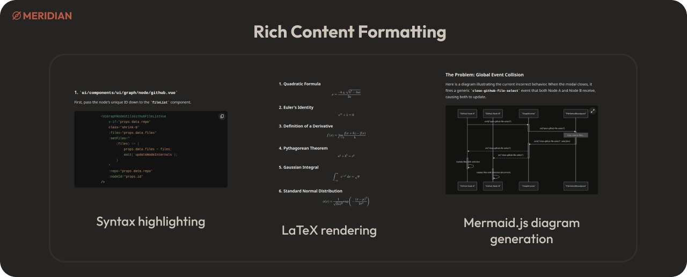

<div align="center">

# Meridian - Graph-Powered Conversational AI

[](https://opensource.org/licenses/MIT)
[](https://nuxt.com/)
[](https://www.python.org/)
[](https://github.com/MathisVerstrepen/Meridian/commits/main)

</div>

## Table of Contents

- [✨ Introduction](#-introduction)
- [🌟 Key Features](#-key-features)
- [🛠️ Technologies Used](#%EF%B8%8F-technologies-used)
- [🏗️ Production Deployment](#%EF%B8%8F-production-deployment)
  - [Prerequisites](#prerequisites)
  - [Deployment Options](#deployment-options)
  - [Essential Configuration](#essential-configuration)
  - [Management Commands](#management-commands)
- [🧑‍💻 Local Development](#-local-development)
  - [Prerequisites](#prerequisites-1)
  - [Development Setup](#development-setup)
  - [Management Commands](#management-commands-1)
- [📄 API Documentation](#-api-documentation)
- [🗺️ Project Structure](#%EF%B8%8F-project-structure)
- [🤝 Contributing](#-contributing)
- [🐛 Issues and Bug Reports](#-issues-and-bug-reports)
- [📄 License](#-license)

## ✨ Introduction

Meridian is an open-source, graph-based platform for building, visualizing, and interacting with complex AI workflows. Instead of traditional linear chats, Meridian uses a visual canvas where you can connect different AI models, data sources, and logic blocks to create powerful and dynamic conversational agents.

This graph-based approach allows for sophisticated context management, branching conversations, and advanced execution patterns like parallel model querying and conditional routing. It provides both a powerful visual graph for building workflows and a clean, feature-rich chat interface for interacting with them.

<p align="center">
    
</p>

<p align="center">
    
</p>

## 🌟 Key Features

*   **Visual Graph Canvas**: At its core, Meridian provides an interactive canvas where you can build, manage, and visualize AI workflows as interconnected nodes.

*   **Modular Node System**:
    *   **Input Nodes**: Provide context from various sources, including plain text (`Prompt`), local files (`Attachment`), and entire GitHub repositories (`GitHub`).

    <p align="center">
        
    </p>

    *   **Generator Nodes**: The processing units of the graph.
        *   `Text-to-Text`: A standard Large Language Model (LLM) call.
        *   `Parallelization`: Executes a prompt against multiple LLMs simultaneously and uses an aggregator model to synthesize the results into a single, comprehensive answer.
        *   `Routing`: Dynamically selects the next node or model based on the input, enabling conditional logic in your workflows.

    <p align="center">
        
    </p>

*   **Integrated Chat & Graph Experience**:
    *   A feature-rich chat interface that serves as a user-friendly view of the graph's execution.
    *   The ability to create complex **branching conversations** that are naturally represented and manageable in the graph.

*   **Rich Content & Tooling**:
    *   Full **Markdown** support for text formatting.
    *   **LaTeX** rendering for mathematical and scientific notation.
    *   **Syntax highlighting** for over 200 languages in code blocks.
    *   AI-powered **Mermaid.js diagram generation** for visualizing data and processes.
    *   Deep **GitHub integration** to use code from repositories as context for the AI.

    <p align="center">
        
    </p>

*   **Execution & Orchestration Engine**:
    *   Run entire graphs or specific sub-sections (e.g., all nodes upstream or downstream from a selected point).
    *   A visual execution plan that shows the sequence of node processing in real-time.

*   **Flexible Model Backend**:
    *   Powered by **OpenRouter.ai**, providing access to a vast array of proprietary and open-source models (from OpenAI, Anthropic, Google, Mistral, and more).
    *   Granular control over model parameters on both global and per-canvas levels.

*   **Enterprise-Ready Foundation**:
    *   Secure authentication with support for **OAuth** (GitHub, Google) and standard username/password.
    *   Persistent and robust data storage using **PostgreSQL** for structured data and **Neo4j** for the graph engine.
    *   Cost and token usage tracking for each model call, providing full transparency.
    *   **Monitoring and Error Tracking**: Optional integration with **Sentry** for real-time performance monitoring and error tracking in both frontend and backend services.

> [!TIP]
> Detailed overview of the features in the [Features.md](docs/Features.md) file.

## 🛠️ Technologies Used

*   **Frontend:**
    *   [Nuxt 3](https://nuxt.com/)
    *   [Vue 3](https://vuejs.org/)
    *   [Tailwind CSS](https://tailwindcss.com/)
*   **Backend:**
    *   [Python](https://www.python.org/)
    *   [FastAPI](https://fastapi.tiangolo.com/)
    *   [PostgreSQL](https://www.postgresql.org/)
    *   [Neo4j](https://neo4j.com/)

## 🏗️ Production Deployment

Meridian offers multiple deployment options to suit different needs and environments. Choose the approach that best fits your infrastructure and requirements.

### Prerequisites

*   **Docker and Docker Compose** installed on your machine
*   **[Yq (from Mike Farah)](https://github.com/mikefarah/yq/#install)** for TOML configuration processing
*   **Git** (for cloning the repository)

### Deployment Options

#### Option 1: Quick Start with Pre-built Images (Recommended)

Use pre-built images from GitHub Container Registry for the fastest deployment.

1. **Clone the repository:**
    ```bash
    git clone https://github.com/MathisVerstrepen/Meridian.git
    cd Meridian/docker
    ```

2. **Create your configuration:**
    ```bash
    cp config.example.toml config.toml
    ```
    Edit `config.toml` with your production settings. See [Configuration Guide](docs/Config.md) for details.

3. **Deploy with pre-built images:**
    ```bash
    chmod +x run.sh
    ./run.sh prod -d
    ```

4. **Access the application:**
    Open `http://localhost:3000` (or your configured port) in your web browser.

#### Option 2: Build from Source

Build images locally for customization or when pre-built images aren't suitable.

1. **Clone and configure:**
    ```bash
    git clone https://github.com/MathisVerstrepen/Meridian.git
    cd Meridian/docker
    cp config.example.toml config.toml
    # Edit config.toml with your settings
    ```

2. **Deploy with local builds:**
    ```bash
    chmod +x run.sh
    ./run.sh build -d
    ```

3. **Force rebuild (if needed):**
    ```bash
    ./run.sh build --force-rebuild -d
    ```

### Essential Configuration

Before deploying, you **must** configure these critical settings in your `config.toml`:

#### Required Settings
```toml
[api]
# Get your API key from https://openrouter.ai/
MASTER_OPEN_ROUTER_API_KEY = "sk-or-v1-your-api-key-here"

# Generate secure secrets with: python -c "import os; print(os.urandom(32).hex())"
BACKEND_SECRET = "your-64-character-hex-secret"
JWT_SECRET_KEY = "your-64-character-hex-secret"

[ui]
NUXT_SESSION_PASSWORD = "your-64-character-hex-secret"

[database]
POSTGRES_PASSWORD = "your-secure-database-password"

[neo4j]
NEO4J_PASSWORD = "your-secure-neo4j-password"
```

#### Optional: Sentry for Monitoring
To enable performance monitoring and error tracking, provide your Sentry DSN. If left empty, Sentry will be disabled.

```toml
[sentry]
SENTRY_DSN = "your-sentry-dsn-here"
```

> 📚 **Detailed Configuration Guide:** See [Config.md](docs/Config.md) for complete configuration options and OAuth setup instructions.

### Management Commands

#### Starting Services
```bash
# Production mode with pre-built images
./run.sh prod -d

# Build mode (compile locally)
./run.sh build -d

# Force rebuild without cache
./run.sh build --force-rebuild -d
```

#### Stopping Services
```bash
# Stop services (preserve data)
./run.sh prod down

# Stop services and remove volumes (⚠️ deletes all data)
./run.sh prod down -v
```

#### Monitoring and Maintenance
```bash
# View logs
docker compose -f docker-compose.prod.yml logs -f

# Check service status
docker compose -f docker-compose.prod.yml ps

# Update to latest images
docker compose -f docker-compose.prod.yml pull
./run.sh prod down
./run.sh prod -d
```

## 🧑‍💻 Local Development

Set up Meridian for local development with hot reloading, debugging capabilities, and direct access to logs. This setup runs databases in Docker while keeping the application services local for optimal development experience.

### Prerequisites

*   **Docker and Docker Compose** installed on your machine
*   **[Yq (from Mike Farah)](https://github.com/mikefarah/yq/#install)** for TOML configuration processing
*   **Python 3.11 or higher** for the backend
*   **Node.js 18+ and npm/pnpm** for the frontend
*   **Git** (for cloning the repository)

### Development Setup

#### 1. Clone and Configure

```bash
# Clone the repository
git clone https://github.com/MathisVerstrepen/Meridian.git
cd Meridian/docker

# Create local development configuration
cp config.local.example.toml config.local.toml
```

#### 2. Configure for Development

Edit `config.local.toml` with your development settings:

```toml
[general]
ENV = "dev"
NAME = "meridian_dev"

[ui]
NITRO_PORT = 3000
NUXT_PUBLIC_API_BASE_URL = "http://localhost:8000"
NUXT_API_INTERNAL_BASE_URL = "http://localhost:8000"  # Direct to local backend
NUXT_PUBLIC_IS_OAUTH_DISABLED = "true"  # Simplify development
# Generate with: python -c "import os; print(os.urandom(32).hex())"
NUXT_SESSION_PASSWORD = "your-development-session-secret"

[api]
API_PORT = 8000
ALLOW_CORS_ORIGINS = "http://localhost:3000"
# Get your API key from https://openrouter.ai/
MASTER_OPEN_ROUTER_API_KEY = "sk-or-v1-your-api-key-here"
# Generate secrets with: python -c "import os; print(os.urandom(32).hex())"
BACKEND_SECRET = "your-development-backend-secret"
JWT_SECRET_KEY = "your-development-jwt-secret"

[database]
POSTGRES_HOST = "localhost"  # Connect to Docker database from host
POSTGRES_PORT = 5432
POSTGRES_PASSWORD = "dev-postgres-password"

[neo4j]
NEO4J_HOST = "localhost"  # Connect to Docker Neo4j from host
NEO4J_BOLT_PORT = 7687
NEO4J_HTTP_PORT = 7474
NEO4J_PASSWORD = "dev-neo4j-password"
```

> 📚 **Configuration Reference:** See [Config.md](docs/Config.md) for all available options.

#### 3. Start Development Databases

```bash
# Start only PostgreSQL and Neo4j in Docker
chmod +x run.sh
./run.sh dev -d
```

This command starts only the database containers, leaving the application services for manual startup.

#### 4. Set Up and Start Backend

Open a new terminal for the backend:

```bash
cd Meridian/api

# Create Python virtual environment
python3 -m venv venv
source venv/bin/activate  # On Windows: venv\Scripts\activate

# Install dependencies
pip install -r requirements.txt

# Start the backend with hot reloading
cd app
fastapi dev main.py --host 0.0.0.0 --port 8000
```

**Backend will be available at:** `http://localhost:8000`
**API Documentation:** `http://localhost:8000/docs`

#### 5. Set Up and Start Frontend

Open another terminal for the frontend:

```bash
cd Meridian/ui

# Install dependencies (choose your preferred package manager)
npm install
# OR
pnpm install

# Start development server with hot reloading
npm run dev
# OR
pnpm dev
```

**Frontend will be available at:** `http://localhost:3000`

### Management Commands

#### Database Management

```bash
# Start development databases
./run.sh dev -d

# Stop databases (preserve data)
./run.sh dev down

# Stop and remove all data (⚠️ destroys development data)
./run.sh dev down -v

# View database logs
docker compose logs -f db neo4j

# Access database directly
docker compose exec db psql -U postgres -d postgres
```

#### Application Management

```bash
# Backend commands (in api/ directory with venv activated)
fastapi dev main.py              # Development server

# Frontend commands (in ui/ directory)
npm run dev                     # Development server
npm run build                   # Build for production
npm run preview                 # Preview production build
```

## 📄 API Documentation

The backend API documentation (powered by FastAPI's Swagger UI) will be available at:
`http://localhost:8000/docs` (when the backend is running).

## 🗺️ Project Structure

```
Meridian/
├── docker/          # Docker-related files and configurations files
├── api/             # Backend API code
├── ui/              # Frontend code
├── docs/            # Documentation files
├── README.md        # Project overview and setup instructions
```

## 🤝 Contributing

We welcome contributions to Meridian! Whether it's adding new features, improving existing ones, or fixing bugs, your help is appreciated.

## 🐛 Issues and Bug Reports

Found a bug or have a feature request? Please open an issue on our [GitHub Issues page](https://github.com/MathisVerstrepen/Meridian/issues).

## 📄 License

This project is licensed under the MIT License - see the [LICENSE](LICENSE) file for details.

---

Made with ❤️ by Mathis Verstrepen
