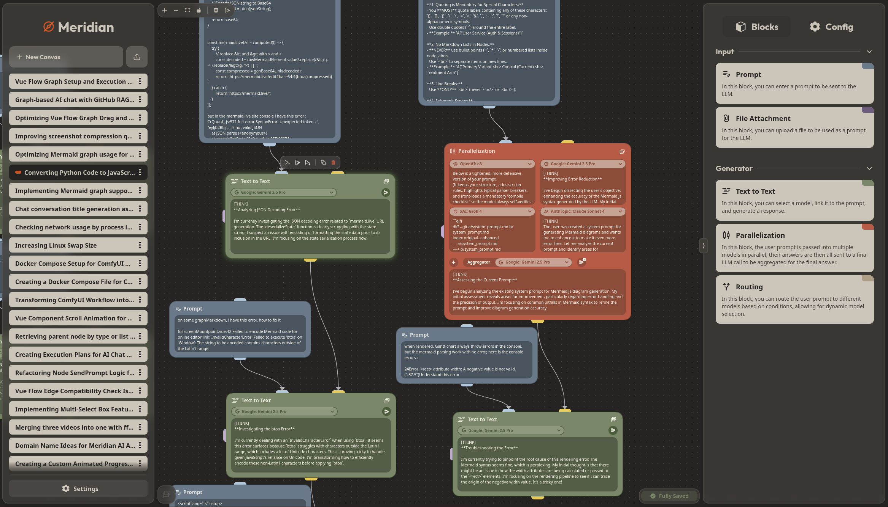
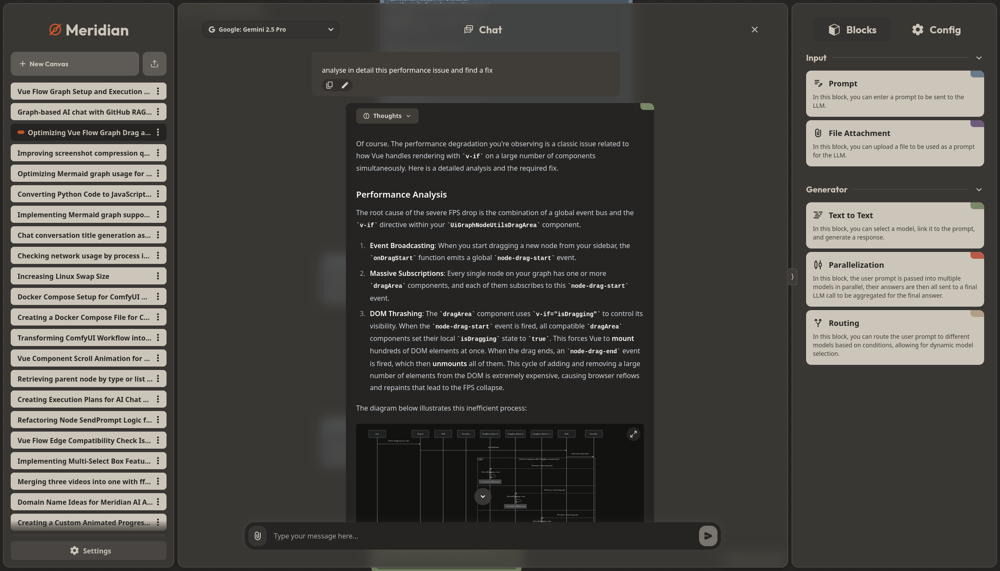

<div align="center">

# Meridian - Graph-Powered Conversational AI

[](https://opensource.org/licenses/MIT)
[](https://nuxt.com/)
[](https://www.python.org/)
[](https://github.com/MathisVerstrepen/Meridian/commits/main)

</div>

## Table of Contents

- [✨ Introduction](#-introduction)
- [🌟 Key Features](#-key-features)
- [🛠️ Technologies Used](#%EF%B8%8F-technologies-used)
- [🏗️ Production Deployment](#%EF%B8%8F-production-deployment)
  - [Prerequisites](#prerequisites)
  - [Production Deployment Setup](#production-deployment-setup)
- [🧑‍💻 Local Development](#-local-development)
  - [Prerequisites](#prerequisites-1)
  - [Local Development Setup](#local-development-setup)
- [📄 API Documentation](#-api-documentation)
- [🗺️ Project Structure](#%EF%B8%8F-project-structure)
- [🤝 Contributing](#-contributing)
- [🐛 Issues and Bug Reports](#-issues-and-bug-reports)
- [📄 License](#-license)

## ✨ Introduction

Meridian is an open-source, graph-based platform for building, visualizing, and interacting with complex AI workflows. Instead of traditional linear chats, Meridian uses a visual canvas where you can connect different AI models, data sources, and logic blocks to create powerful and dynamic conversational agents.

This graph-based approach allows for sophisticated context management, branching conversations, and advanced execution patterns like parallel model querying and conditional routing. It provides both a powerful visual graph for building workflows and a clean, feature-rich chat interface for interacting with them.

<p align="center">
    
</p>

<p align="center">
    
</p>

## 🌟 Key Features

*   **Visual Graph Canvas**: At its core, Meridian provides an interactive canvas where you can build, manage, and visualize AI workflows as interconnected nodes.

*   **Modular Node System**:
    *   **Input Nodes**: Provide context from various sources, including plain text (`Prompt`), local files (`Attachment`), and entire GitHub repositories (`GitHub`).
    *   **Generator Nodes**: The processing units of the graph.
        *   `Text-to-Text`: A standard Large Language Model (LLM) call.
        *   `Parallelization`: Executes a prompt against multiple LLMs simultaneously and uses an aggregator model to synthesize the results into a single, comprehensive answer.
        *   `Routing`: Dynamically selects the next node or model based on the input, enabling conditional logic in your workflows.

*   **Integrated Chat & Graph Experience**:
    *   A feature-rich chat interface that serves as a user-friendly view of the graph's execution.
    *   The ability to create complex **branching conversations** that are naturally represented and manageable in the graph.

*   **Rich Content & Tooling**:
    *   Full **Markdown** support for text formatting.
    *   **LaTeX** rendering for mathematical and scientific notation.
    *   **Syntax highlighting** for over 200 languages in code blocks.
    *   AI-powered **Mermaid.js diagram generation** for visualizing data and processes.
    *   Deep **GitHub integration** to use code from repositories as context for the AI.

*   **Execution & Orchestration Engine**:
    *   Run entire graphs or specific sub-sections (e.g., all nodes upstream or downstream from a selected point).
    *   A visual execution plan that shows the sequence of node processing in real-time.

*   **Flexible Model Backend**:
    *   Powered by **OpenRouter.ai**, providing access to a vast array of proprietary and open-source models (from OpenAI, Anthropic, Google, Mistral, and more).
    *   Granular control over model parameters on both global and per-canvas levels.

*   **Enterprise-Ready Foundation**:
    *   Secure authentication with support for **OAuth** (GitHub, Google) and standard username/password.
    *   Persistent and robust data storage using **PostgreSQL** for structured data and **Neo4j** for the graph engine.
    *   Cost and token usage tracking for each model call, providing full transparency.


> See a detailed overview of the features in the [Features.md](docs/Features.md) file.

## 🛠️ Technologies Used

*   **Frontend:**
    *   [Nuxt 3](https://nuxt.com/)
    *   [Vue 3](https://vuejs.org/)
    *   [Tailwind CSS](https://tailwindcss.com/)
*   **Backend:**
    *   [Python](https://www.python.org/)
    *   [FastAPI](https://fastapi.tiangolo.com/)
    *   [PostgreSQL](https://www.postgresql.org/)
    *   [Neo4j](https://neo4j.com/)

## 🏗️ Production Deployment

### Prerequisites

*   Docker and Docker Compose installed on your machine.
*   [Yq (from Mike Farah)](https://github.com/mikefarah/yq/#install) for TOML processing.

### Production Deployment Setup

1. **Clone the repository:**
    ```bash
    git clone https://github.com/MathisVerstrepen/Meridian.git
    cd Meridian/docker
    ```

2. **Create a `config.toml` file:**
    Copy the `config.example.toml` file to `config.toml` and customize it with your production settings.
    ```bash
    cp config.example.toml config.toml
    ```
    Then set the necessary environment variables in the `config.toml` file.

> A detailed explanation of the configuration options can be found in the [Config.md](docs/Config.md) file.

3. **Start Meridian:**
    Use the provided bash script to start the Docker services. 
    This will start the two databases (PostgreSQL and Neo4j), the backend API server, and the frontend application.
    ```bash
    chmod +x run.sh
    ./run.sh up -d
    ```

4. **Access the application:**
    Open your web browser and navigate to `http://localhost:3000` (default port) to access the Meridian frontend.

## 🧑‍💻 Local Development

### Prerequisites

*   Docker and Docker Compose installed on your machine.
*   [Yq (from Mike Farah)](https://github.com/mikefarah/yq/#install) for TOML processing.
*   Python 3.11 or higher installed on your machine.
*   [Node.js](https://nodejs.org/) and [npm](https://www.npmjs.com/) installed on your machine for the frontend.

### Local Development Setup

1. **Clone the repository:**
    ```bash
    git clone https://github.com/MathisVerstrepen/Meridian.git
    cd Meridian/docker
    ```

2. **Create a `config.local.toml` file:**
    Copy the `config.local.example.toml` file to `config.local.toml` and customize it with your settings.
    ```bash
    cp config.local.example.toml config.local.toml
    ```
    Then set the necessary environment variables in the `config.local.toml` file.

> A detailed explanation of the configuration options can be found in the [Config.md](docs/Config.md) file.

3. **Start the databases:**
    Use the provided bash script to start the Docker services. This will start the two databases (PostgreSQL and Neo4j).
    ```bash
    chmod +x run.sh
    ./run.sh dev -d
    ```

4. **Start the backend:**
    Open a new terminal window and run the backend server using Docker Compose.
    ```bash
    cd ../api
    python3 -m venv venv
    source venv/bin/activate
    pip install -r requirements.txt
    cd app
    fastapi dev main.py
    ```

5. **Start the frontend:**
    Open another terminal window and run the frontend server.
    ```bash
    cd ../ui
    npm install
    npm run dev
    ```

6. **Access the application:**
    Open your web browser and navigate to `http://localhost:3000` (default port) to access the Meridian frontend.


## 📄 API Documentation

The backend API documentation (powered by FastAPI's Swagger UI) will be available at:
`http://localhost:8000/docs` (when the backend is running).

## 🗺️ Project Structure

```
Meridian/
├── docker/          # Docker-related files and configurations files
├── api/             # Backend API code
├── ui/              # Frontend code
├── docs/            # Documentation files
├── README.md        # Project overview and setup instructions
```

## 🤝 Contributing

We welcome contributions to Meridian! Whether it's adding new features, improving existing ones, or fixing bugs, your help is appreciated.

## 🐛 Issues and Bug Reports

Found a bug or have a feature request? Please open an issue on our [GitHub Issues page](https://github.com/MathisVerstrepen/Meridian/issues).

## 📄 License

This project is licensed under the MIT License - see the [LICENSE](LICENSE) file for details.

---

Made with ❤️ by Mathis Verstrepen
