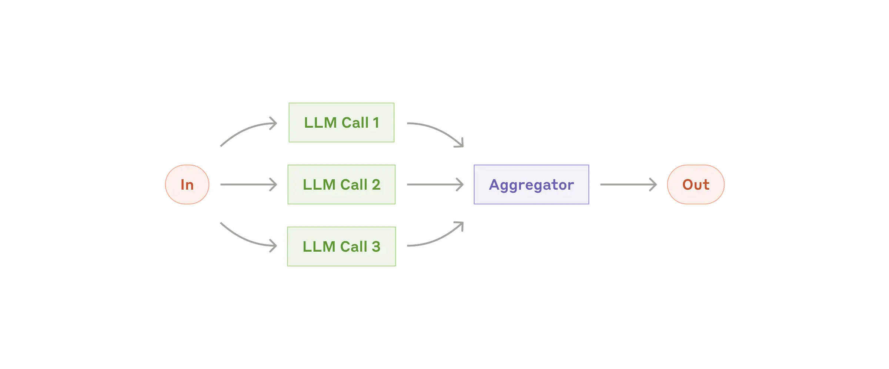
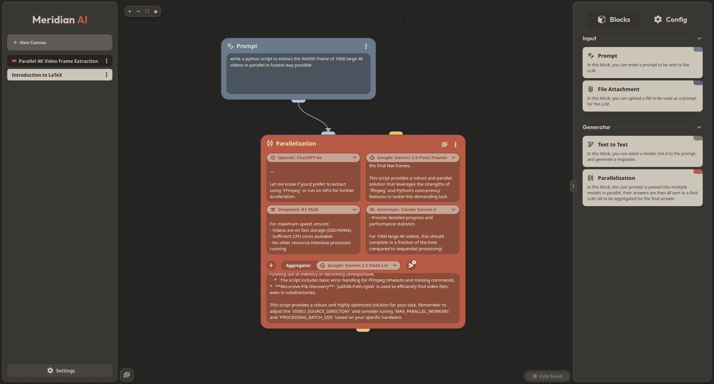
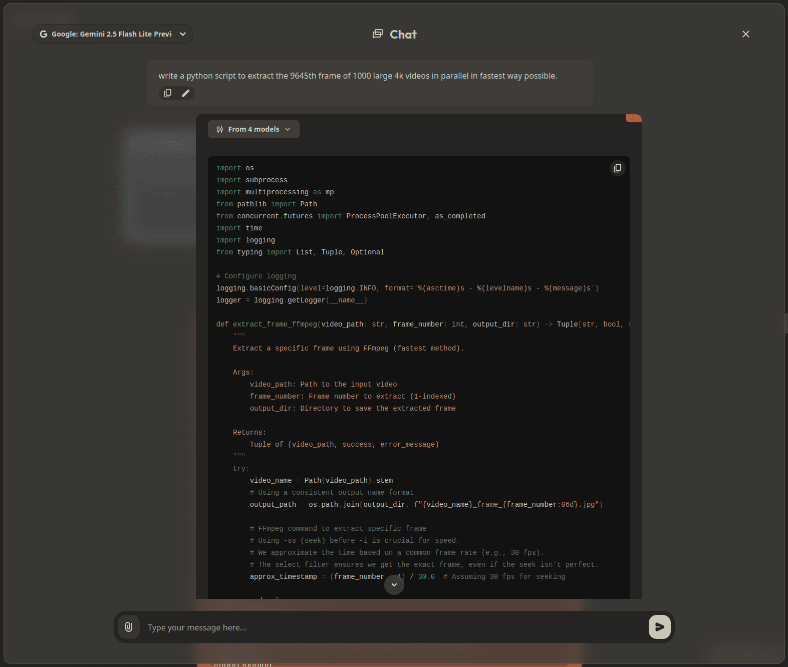
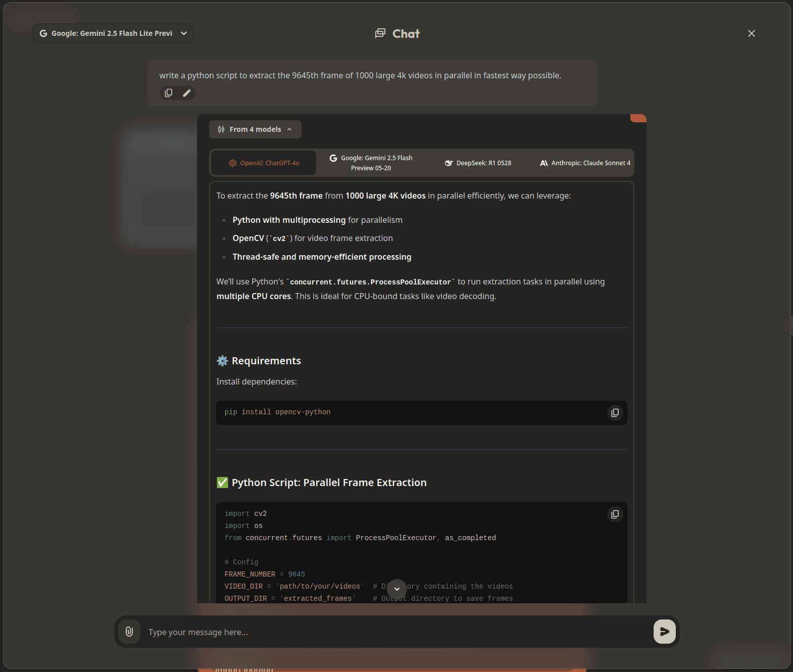
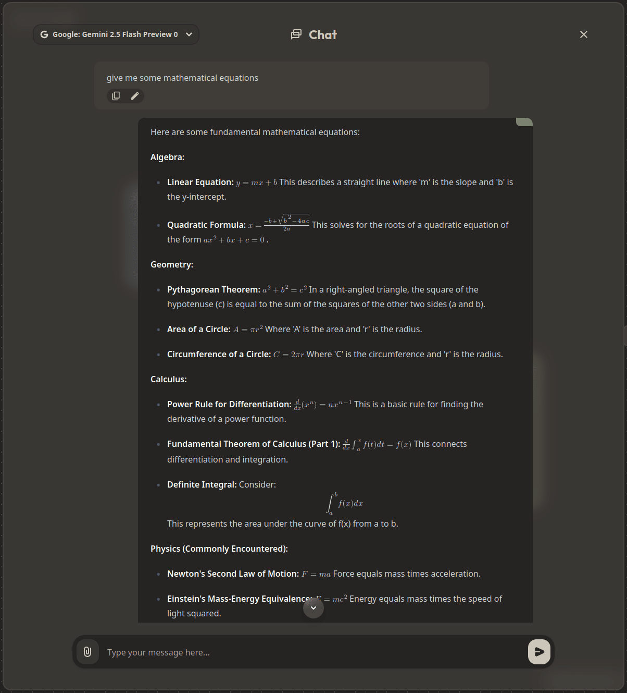

# Meridian - Features 

## Graph-Based AI Engine & Chat Branching

Meridian is built around the Neo4j graph database, which allows it to represent an AI chat as a graph structure. 

In the following image, you can see how the graph view displays the relationships between different nodes in a conversation, making it easy to visualize and navigate through complex discussions.

Here the user has asked the starting question "what is LaTeX ?", the answer is provided by the LLM in the following `Text to Text`
node, but then the users had 3 different follow-up questions. This is how Meridian can handle branching conversations, allowing users to explore different paths and topics 
while still being easy to navigate. Therefore 3 different `Text to Text` nodes are created, each with its own follow-up question and answer.

## Parallel Query Processing

Meridian supports parallel query processing, which means that user prompts can be dispatched to multiple LLMs simultaneously 
and then intelligently combined by a final LLM to deliver a unified and comprehensive answer.

This feature is inspired from this [Anthropic Article](https://www.anthropic.com/engineering/building-effective-agents) and is illustrated in the following schema :

    

To implement this, Meridian uses a new node. Instead of a single `Text to Text` node, we have a `Parallelization` node.

Here is how it looks like in the graph view with 4 models being used in parallel :

We can switch two the chat view to see how the conversation looks like with the parallelization node :

    

        
        
<em>Not expanded</em>

    

    

        
        
<em>Expanded</em>

    

## Model Agnostic

Meridian is powered by [OpenRouter](https://openrouter.ai/), which allows it to be model agnostic.
This means that you can easily switch between different AI models and use the one that best fits your needs.

As OpenRouter supports a wide range of models, we developed an advanced, configurable, and user-friendly dropdown
menu to select the model you want to use for each node.

    

With this dropdown, you can pin your favorite models to the top, search for models, see model details, hide free or paid models and sort them by name or release date.

## Oauth & UserPass

Meridian supports both Oauth and UserPass authentication methods, allowing you to choose the one that best fits your needs.

Oauth can be disabled in the configuration file, and UserPass is enabled by default.
UserPass registration is only available in the configuration file.

## Attachment Support

Meridian allows users to upload attachments, enhancing the context and richness of conversations.
Attachments can be images or pdf files, and they are displayed in the chat view.
More document types are planned to be supported in the future.

## Syntax Highlighting

Meridian supports syntax highlighting for code snippets, making it easier to read and understand technical content.

Powered by [Shiki](https://github.com/shikijs/shiki) and a dynamic language grammars bundle fetching system, Meridian
can highlight code snippets for **220+ languages** without increasing the bundle size.

## LaTeX Rendering

Meridian supports LaTeX rendering, allowing for clear communication of complex mathematical expressions and ideas.

This is powered by [KaTeX](https://github.com/KaTeX/KaTeX), which is a fast and lightweight LaTeX rendering library.

    

## Highly Customizable

Meridian is highly configurable, allowing you to tailor the system to your specific needs and preferences.

Here is an example of a settings page where you can configure various aspects of the application : 

    

