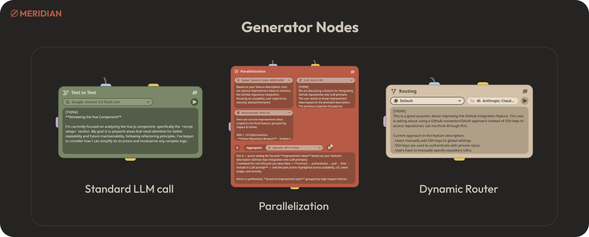

# Meridian - Detailed Feature Overview

This document provides a detailed breakdown of the features available in Meridian, from its core graph-based architecture to its rich user interface and powerful customization options.

## Table of Contents

- [Core Architecture](#core-architecture)
  - [Graph-Based Engine](#graph-based-engine)
  - [Visual Canvas](#visual-canvas)
  - [Integrated Chat Interface](#integrated-chat-interface)
- [Node System & Workflow Creation](#node-system--workflow-creation)
  - [Input Nodes](#input-nodes)
  - [Generator Nodes](#generator-nodes)
- [Execution & Orchestration](#execution--orchestration)
  - [Execution Control](#execution-control)
  - [Real-time Execution Plan](#real-time-execution-plan)
- [Model Management](#model-management)
  - [OpenRouter Integration](#openrouter-integration)
  - [Advanced Model Selector](#advanced-model-selector)
- [Rich Content & Tooling](#rich-content--tooling)
  - [Markdown, LaTeX, and Syntax Highlighting](#markdown-latex-and-syntax-highlighting)
  - [AI-Powered Diagram Generation](#ai-powered-diagram-generation)
  - [GitHub Repository Integration](#github-repository-integration)
- [User & Session Management](#user--session-management)
  - [Secure Authentication](#secure-authentication)
- [System & Customization](#system--customization)
  - [Comprehensive Settings](#comprehensive-settings)
  - [Cost and Token Usage Tracking](#cost-and-token-usage-tracking)

---

## Core Architecture

### Graph-Based Engine

Meridian is built on a robust hybrid data model. It uses **PostgreSQL** for storing structured data like user information, graph metadata, and settings, while leveraging a **Neo4j** graph database for managing the complex relationships between conversational nodes. This allows for efficient traversal and querying of conversation history, enabling advanced features like branching and sophisticated context-gathering.

### Visual Canvas

The primary interface for building and managing AI workflows is a dynamic, interactive canvas. Users can drag and drop different nodes, connect them to define data flow, and arrange them to visualize the entire workflow. This visual approach makes it intuitive to design and debug complex, non-linear interactions that would be difficult to represent in a traditional, linear chat format.

    

### Integrated Chat Interface

Alongside the graph view, Meridian offers a polished and feature-rich chat interface. This interface acts as a user-friendly "view" of the graph's execution. As you interact with the chat, the underlying graph is built and updated in real-time. You can seamlessly switch between the chat and graph views, and even initiate or continue a conversation from any node in the graph, naturally creating complex **branching conversations**.

    

---

## Node System & Workflow Creation

Meridian's power comes from its modular node system, which is divided into two main categories: Input and Generator nodes.

### Input Nodes

Input nodes provide the initial data or context for the generator nodes.

-   **Prompt**: A simple text input node for writing prompts.
-   **Attachment**: Allows uploading local files (images, PDFs) to be included as context.
-   **GitHub**: A powerful node that integrates with a user's GitHub account to select entire repositories and specific files to be used as context for the AI.

    

### Generator Nodes

Generator nodes are the processing units of the graph that perform actions, typically involving LLM calls.

-   **Text-to-Text**: A standard node for making a call to a Large Language Model.
-   **Parallelization**: Executes a single prompt against multiple LLMs simultaneously. It then uses a final "aggregator" model to synthesize the parallel responses into a single, comprehensive answer. This is ideal for tasks requiring diverse perspectives or robust fact-checking.
-   **Routing**: Enables conditional logic within the graph. This node can dynamically select the next node or model to use based on the content of the input, allowing for the creation of sophisticated, stateful agents.

    

---

## Execution & Orchestration

### Execution Control

Meridian provides fine-grained control over workflow execution. From the run toolbar on any selected node, you can choose to:
-   **Run Upstream**: Execute all parent nodes that lead to the selected node.
-   **Run Downstream**: Execute the selected node and all of its children.
-   **Run Selected**: Execute only the currently selected node(s).
-   **Run All**: Execute the entire graph from its starting points.

### Real-time Execution Plan

When a workflow is executed, a visual execution plan appears, showing the sequence of node processing in real-time. It highlights which nodes are currently running, which are queued, and which have completed, providing a clear, transparent view of the orchestration engine at work.

---

## Model Management

### OpenRouter Integration

Meridian is powered by **OpenRouter.ai**, which acts as a gateway to a vast array of proprietary and open-source models from providers like OpenAI, Anthropic, Google, Mistral, and more. This makes the platform model-agnostic and future-proof.

### Advanced Model Selector

To manage the wide variety of available models, Meridian includes an advanced model selector with features designed for power users:
-   **Pinning**: Keep your favorite or most-used models at the top of the list for quick access.
-   **Filtering**: Hide free or paid models to narrow down the selection.
-   **Sorting**: Sort models by name or release date.
-   **Detailed Info**: View pricing and context window length for each model directly in the selector.

    

---

## Rich Content & Tooling

### Markdown, LaTeX, and Syntax Highlighting

The chat interface and node editors support a rich set of formatting options:
-   **Markdown**: Full support for text formatting, lists, links, and more.
-   **LaTeX**: Render complex mathematical and scientific notation beautifully using KaTeX.
-   **Syntax Highlighting**: Code blocks are highlighted for over 220 languages, powered by Shiki, with language grammars fetched dynamically to keep the application lightweight.

    

### AI-Powered Diagram Generation

Meridian can generate and render **Mermaid.js** diagrams directly in the chat. Users can ask the AI to create flowcharts, sequence diagrams, Gantt charts, and more to visualize data and processes. The generated diagrams can be viewed in fullscreen, panned, zoomed, and exported as PNGs or raw Mermaid code.

### GitHub Repository Integration

A standout feature is the deep integration with GitHub. Users can connect their GitHub account, browse their repositories, and select specific files or entire directories to be injected as context into the AI's prompt. This is invaluable for tasks like code review, documentation generation, and technical Q&A.

---

## User & Session Management

### Secure Authentication

Meridian ensures secure access with a robust authentication system:
-   **Multiple Providers**: Supports standard username/password login as well as OAuth 2.0 for GitHub and Google.
-   **JWT & Refresh Token Rotation**: Employs a secure session management strategy using short-lived JSON Web Tokens (JWTs) and long-lived, rotating refresh tokens to enhance security and prevent token theft.

---

## System & Customization

### Comprehensive Settings

A dedicated settings panel allows users to configure nearly every aspect of the application, including:
-   **General**: Default behaviors like auto-opening the chat view.
-   **Models**: Global model parameters (temperature, max tokens, etc.) and the default system prompt.
-   **Account**: Manage API keys and passwords.
-   **Appearance**: Switch between light, dark, and OLED themes, and set a custom accent color.
-   **Blocks**: Customize the "Context Wheel," a radial menu for quickly creating connected nodes.

    

### Cost and Token Usage Tracking

To provide full transparency, Meridian tracks and displays the cost and token usage for every model call. This information is available in the footer of each assistant message in the chat, helping users monitor their spending and API usage.

    

